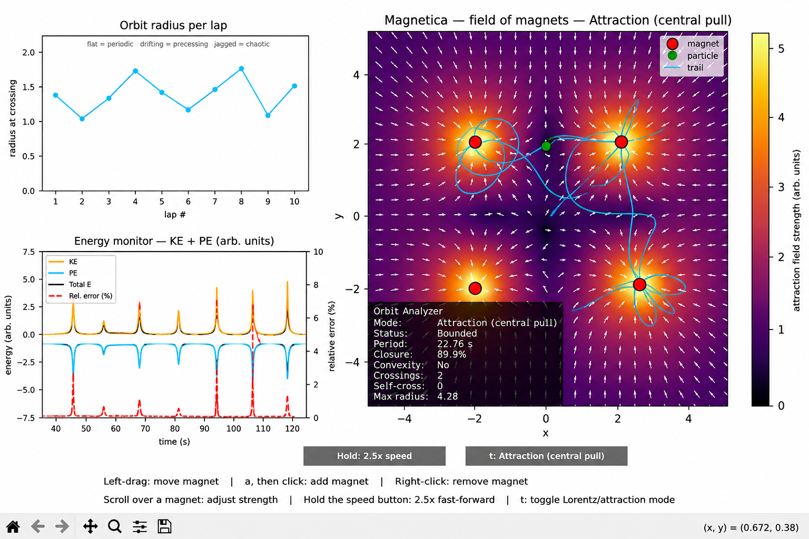

# Magnetica

Place magnets, drop a particle, and watch real physics respond — with a live readout of what the motion is doing, right next to the picture.



## What it does

Magnetica is a small sandbox where you scatter magnets across a 2D canvas and let a charged particle loose among them. Drag a magnet and the particle's path bends in response, live. Two different force models are built in, so you can compare how a real magnetic field pushes a moving charge around against a simpler orbital pull. Alongside the picture, a set of live readouts tracks the particle's energy and orbit shape as it happens — so you're not just watching the motion, you're seeing the physics behind it.

## Physics modes

Magnetica ships with two switchable force models — press `t` to flip between them:

- **Attraction (central pull)** — the default. Each magnet pulls the particle straight toward it, in proportion to the magnet's strength. This produces smooth, stable, orbit-like motion, but it is *not* magnetism — it's a stand-in central force, integrated with velocity Verlet.
- **Lorentz (magnetic)** — the real magnetic force, `F = q(v x B)`, acting on the particle from an out-of-plane field the magnets generate. This is what actually deflects a moving charge; hold a charge still and it feels nothing. Integrated with an exact rotation step that preserves the particle's speed.

The field display always matches whichever mode is running: direction arrows over a strength heatmap in Attraction mode, or a scalar out-of-plane heatmap in Lorentz mode (no arrows there — the field has no in-plane direction to point).

## Features

**Simulation**
- Two switchable physics models: central-pull attraction and real magnetic Lorentz force
- The particle bounces off the visible boundary in Attraction mode; in Lorentz mode it freezes in place if it drifts off-screen, since there's no force left to pull it back
- The field display always matches the force actually driving the particle in the current mode

**Interaction**
- Drag any magnet to move it
- Press `a`, then click, to add a new magnet
- Right-click a magnet to remove it
- Scroll over a magnet to change its strength
- Hold the speed button to fast-forward the simulation
- Press `t` to switch between Attraction and Lorentz mode

**Analysis**
- Live energy monitor — kinetic energy, potential energy, total energy, and relative energy error (Attraction mode only; Lorentz mode has no potential energy to track, so it shows kinetic energy alone)
- Orbit radius per lap, plotted as the particle completes revolutions
- Period, orbit closure percentage, convexity, and crossing counts, computed from where the particle crosses a reference line through the magnets' center

## Controls

| Input | What it does |
|---|---|
| Left-click + drag a magnet | Move it |
| `a`, then click | Add a magnet |
| Right-click a magnet | Remove it |
| Scroll over a magnet | Increase or decrease its strength |
| Hold the speed button | Fast-forward the simulation |
| `t` | Toggle between Attraction and Lorentz mode |

## How to run

```
pip install -r requirements.txt
python -m magnetica.main
```

## Stack

Python, NumPy, Matplotlib.

## Limitations

- Attraction mode's integrator (velocity Verlet) has a small, bounded energy drift over time — not zero, but it stays well-behaved rather than growing without limit.
- Lorentz mode's integrator conserves the particle's speed exactly, since a magnetic force does no work on a moving charge by construction.
- Everything is 2D — there's no out-of-plane geometry or 3D falloff.
- Magnets are point sources with a softening radius, not physically modeled magnet shapes.
- A magnet's orientation doesn't currently affect the simulation — only its strength does.
- Moving or rescaling a magnet mid-run isn't treated as a new energy baseline, so the energy readout can briefly show that as apparent drift rather than true integration error.
- The orbit metrics (period, closure, laps) depend on the particle crossing a specific reference line; some trajectories never cross it and simply won't report those numbers.
- No save or load — your layout is gone when you close the window.

## Future work

- A more general field-aware integrator (Boris pusher) for magnetic fields that vary sharply within a single timestep
- Adaptive timestep for close encounters with a magnet
- Extending the simulation to 3D
- Wiring up magnet orientation into the field model, so direction — not just strength — actually matters
